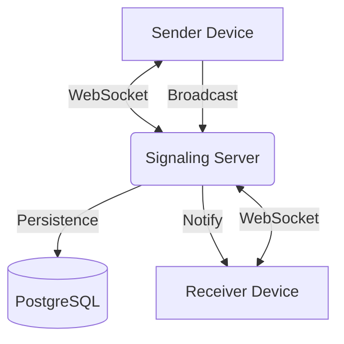

# Architecture Overview: Pair Drop 🏛️

This document details the technical architecture, connection mechanism, and data flow of the Pair Drop application.

## 🏗️ System Design

Pair Drop follows a **Signaling Server** architecture. While the goal is peer-to-peer sharing, the application uses a central server to coordinate connections between devices on the same local network.

### High-Level Architecture

## 🔌 Connection Mechanism

Pair Drop uses a **Session-based pairing** system:

1.  **Session Creation**: A user initiates a session, and the server generates a unique, ephemeral 6-digit numeric code.
2.  **Discovery**:
    -   **Manual**: The receiver enters the 6-digit code.
    -   **QR Code**: The sender displays a QR code containing the session URL (`/session/:code`). Scanning this automatically joins the receiver to the session.
3.  **Signaling**: Once joined, both devices establish a WebSocket connection to the server, pinned to the specific session code.

## 💾 Data Model

The application uses **Drizzle ORM** with **PostgreSQL**. The schema is designed for ephemeral storage.

### Tables
-   **`sessions`**: Stores the unique code and expiry timestamp (24 hours).
-   **`shared_items`**: Stores the shared content.
    -   `type`: Either `text` or `file`.
    -   `content`: The text body or file metadata.
    -   `file_url`: Path to the stored file.

## 📡 Real-time Synchronization

1.  **Trigger**: A device posts a new item to `/api/sessions/:code/items`.
2.  **Broadcast**: The server saves the item to the database and then iterates through all active WebSocket connections for that session code.
3.  **Delivery**: A `NEW_ITEM` event is sent to all connected clients.
4.  **UI Update**: Clients receive the event and trigger a TanStack Query invalidation to refetch the item list, ensuring consistency across all devices.

## 🔒 Security & Privacy

-   **Ephemeral Storage**: All data is automatically deleted or treated as expired after 24 hours.
-   **No Logins**: No PII (Personally Identifiable Information) is collected.
-   **Isolation**: Sessions are isolated by their 6-digit code.

---

[Back to README](file:///m:/40.%20Go%20Lang%20Practice/Pair-Drop/readme.md)
